# MySQL MCP Server 架构

本文档提供 MySQL MCP Server 的详细架构图。

## 目录

- [高层架构](#高层架构)
- [组件结构](#组件结构)
- [请求流程](#请求流程)
  - [MCP 模式](#mcp-模式-stdio)
  - [HTTP REST API 模式](#http-rest-api-模式)
  - [Metrics HTTP 边车（stdio）](#metrics-http-边车-stdio)
- [配置加载](#配置加载)
- [连接管理](#连接管理)
- [工具分类](#工具分类)

---

## 高层架构

MySQL MCP Server 充当 AI 客户端与 MySQL 数据库之间的桥梁，支持通过 **stdio** 的 MCP 协议、可选的 **HTTP REST API**（设置 `MYSQL_MCP_HTTP=1`），以及可选的 **仅 metrics HTTP 监听器**（设置 `MYSQL_MCP_METRICS_HTTP=1`，在 stdio MCP 基础上提供 `/health`、`/status`、`/api/metrics/tokens`，监听 `MYSQL_HTTP_PORT`）。

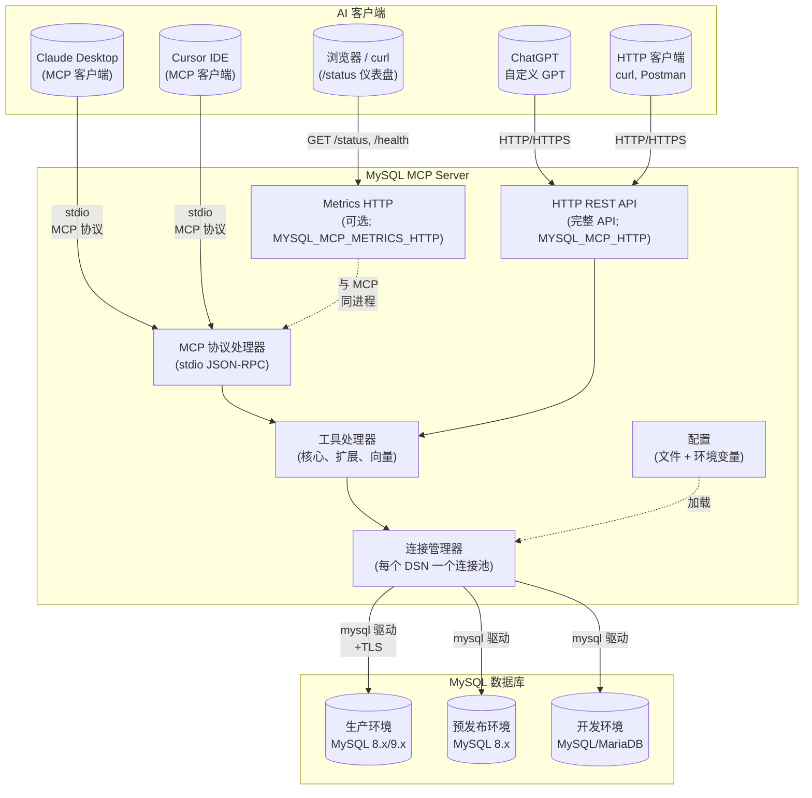

---

## 组件结构

代码库按清晰的职责划分为多个包。

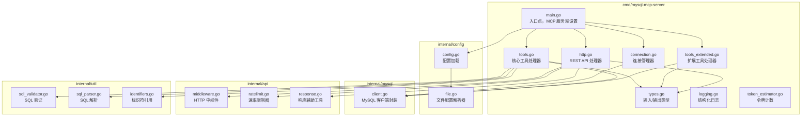

---

## 请求流程

### MCP 模式（stdio）

在 MCP 模式下，服务器通过 stdin/stdout 使用 JSON-RPC 通信。

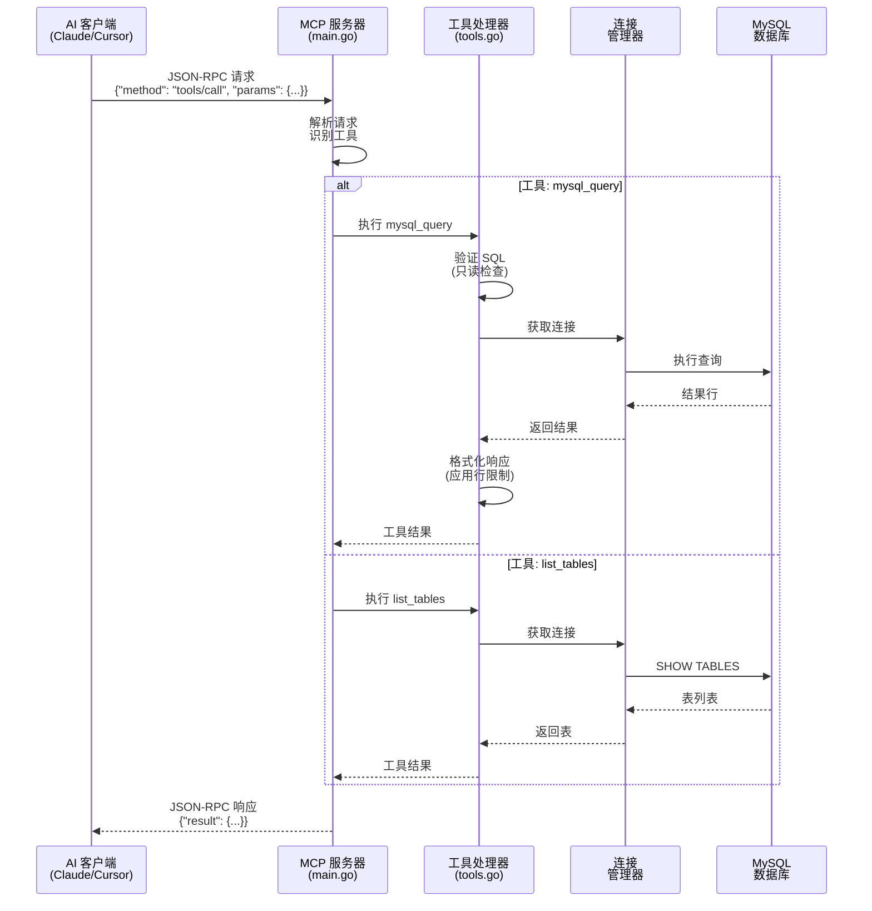

### HTTP REST API 模式

在 HTTP 模式下，服务器暴露 RESTful 端点。

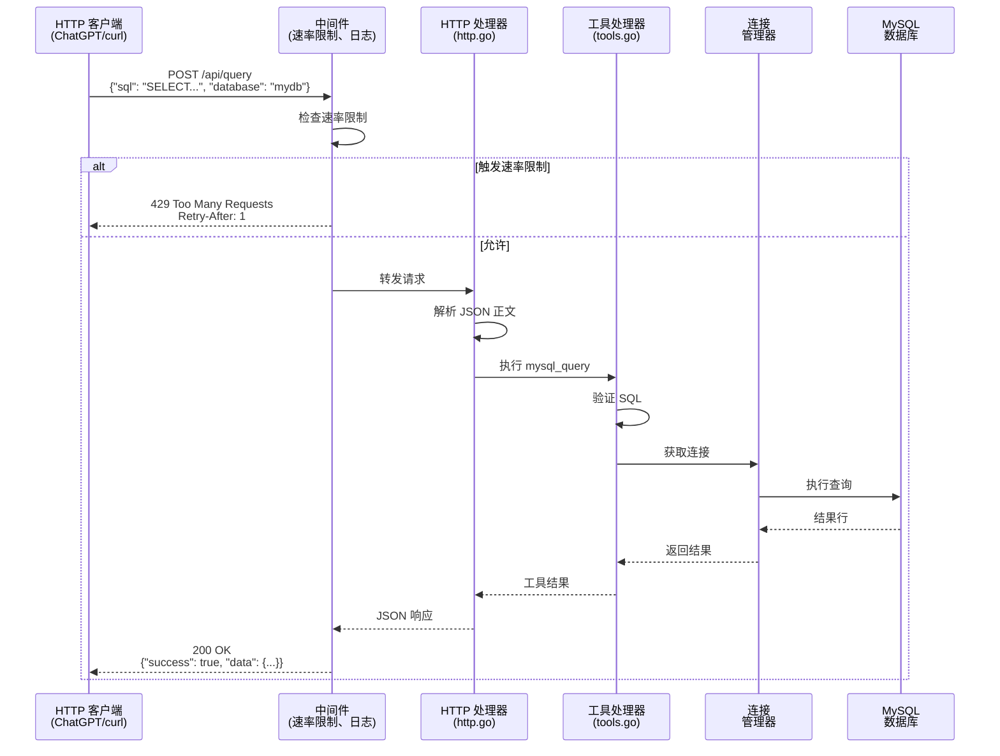

### Metrics HTTP 边车（stdio）

当 `MYSQL_MCP_METRICS_HTTP=1` 且 `MYSQL_MCP_HTTP` 不是主要的全 REST 模式时，进程保持 **stdio MCP** 并在 `MYSQL_HTTP_PORT`（默认 **9306**）上启动一个小型 HTTP 服务器，用于 `/health`、`/api/metrics/tokens` 和 `/status`。这与同一 MCP 工具调用（例如 Claude Desktop）共享 **token 指标**。全 REST 模式（`MYSQL_MCP_HTTP=1`）会取代此边车。

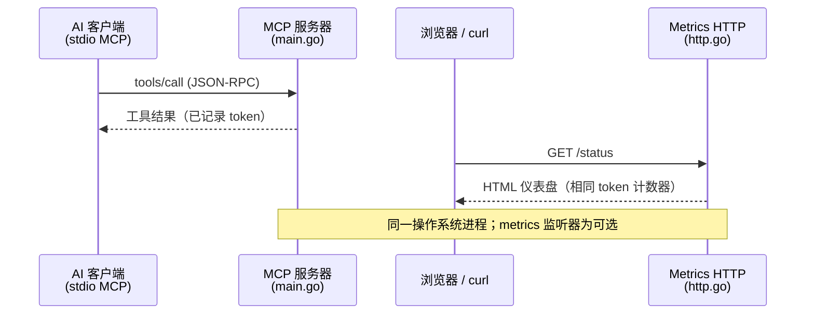

---

## 配置加载

配置从多个来源加载，具有明确的优先级顺序。

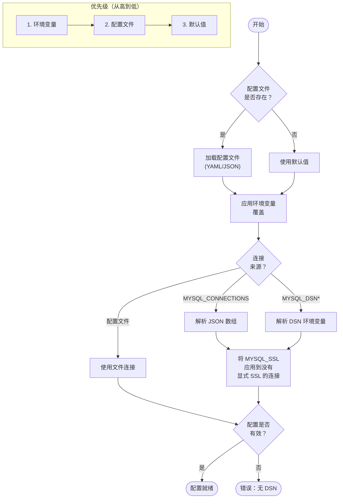

### 配置文件搜索顺序

服务器按以下顺序搜索配置文件（先找到的优先）：

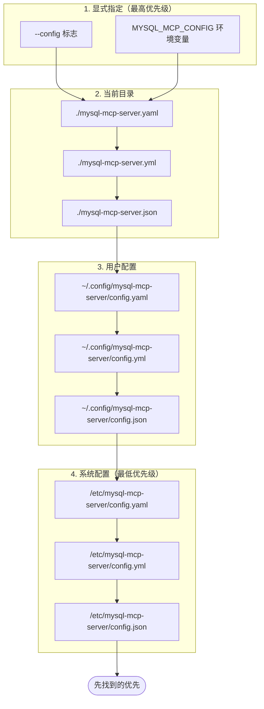

---

## 连接管理

连接管理器处理多个数据库连接，支持连接池。

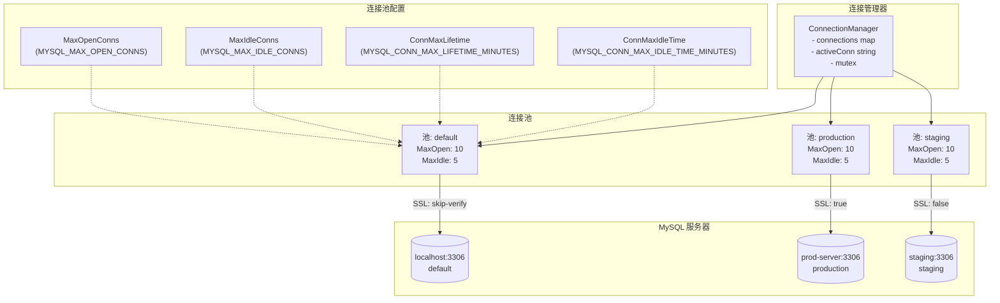

### 连接选择流程

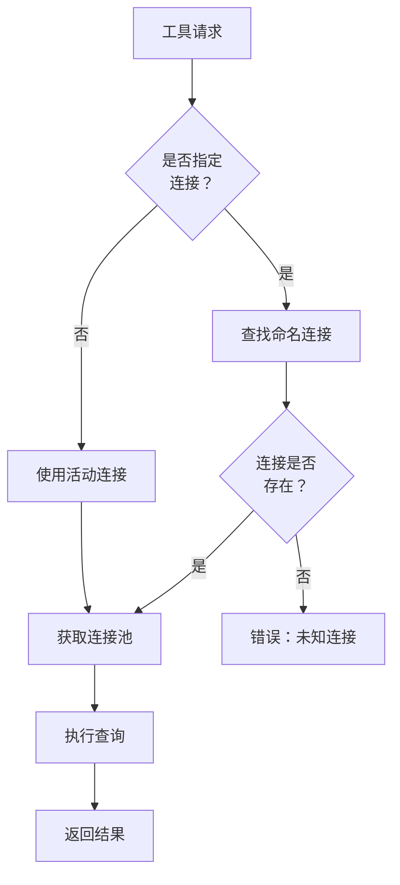

---

## 工具分类

工具按功能分为三类。

```mermaid
graph TB
    subgraph "核心工具（始终可用）"
        direction LR
        mysql_query["mysql_query<br/>执行只读 SQL"]
        list_databases["list_databases<br/>显示所有数据库"]
        list_tables["list_tables<br/>显示数据库中的表"]
        describe_table["describe_table<br/>显示表结构"]
        ping["ping<br/>测试连接"]
        server_info["server_info<br/>MySQL 版本信息"]
        list_connections["list_connections<br/>显示所有 DSN"]
        use_connection["use_connection<br/>切换活动 DSN"]
    end
    
    subgraph "扩展工具（MYSQL_MCP_EXTENDED=1）"
        direction LR
        list_indexes["list_indexes"]
        show_create_table["show_create_table"]
        explain_query["explain_query"]
        list_views["list_views"]
        list_triggers["list_triggers"]
        list_procedures["list_procedures"]
        list_functions["list_functions"]
        list_partitions["list_partitions"]
        get_database_size["get_database_size"]
        get_table_sizes["get_table_sizes"]
        list_foreign_keys["list_foreign_keys"]
        show_status["show_status"]
        show_variables["show_variables"]
    end
    
    subgraph "向量工具（MYSQL_MCP_VECTOR=1）"
        direction LR
        vector_search["vector_search<br/>相似度搜索"]
        get_vector_info["get_vector_info<br/>向量列信息"]
    end
    
    Core["启用：<br/>默认"] --> mysql_query
    Extended["启用：<br/>MYSQL_MCP_EXTENDED=1"] --> list_indexes
    Vector["启用：<br/>MYSQL_MCP_VECTOR=1"] --> vector_search
```

---

## 安全架构

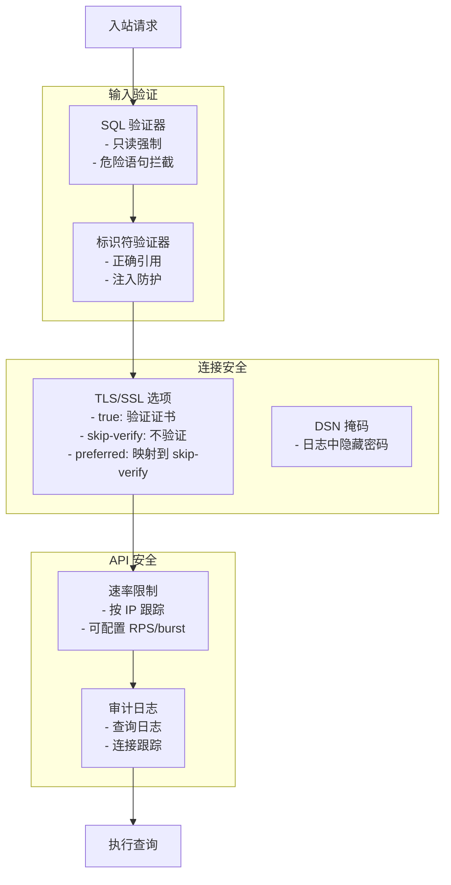

---

## 部署选项

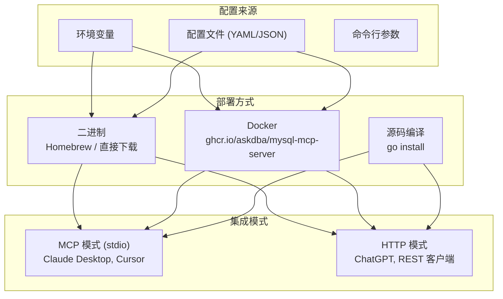

关于以后台服务方式运行服务器（如 systemd 或 launchd）并减少日志输出，请参阅[静默与守护进程模式](silent-and-daemon.md)。

---

## 数据流总结

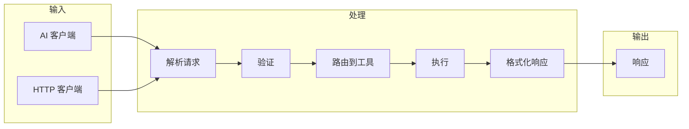

---

## 参见

- [静默与守护进程模式](silent-and-daemon.md) — `--silent`、`--daemon` 及服务管理器模板（systemd、launchd）。